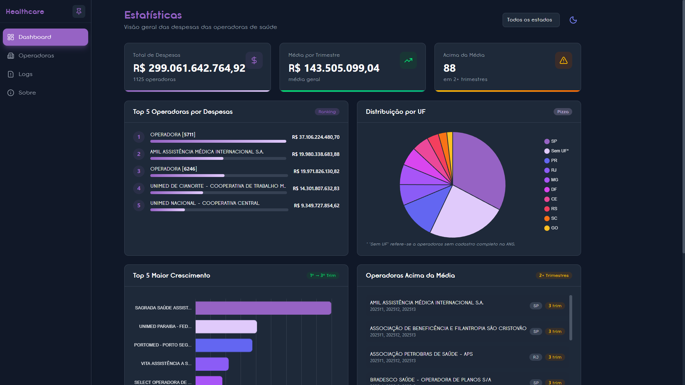
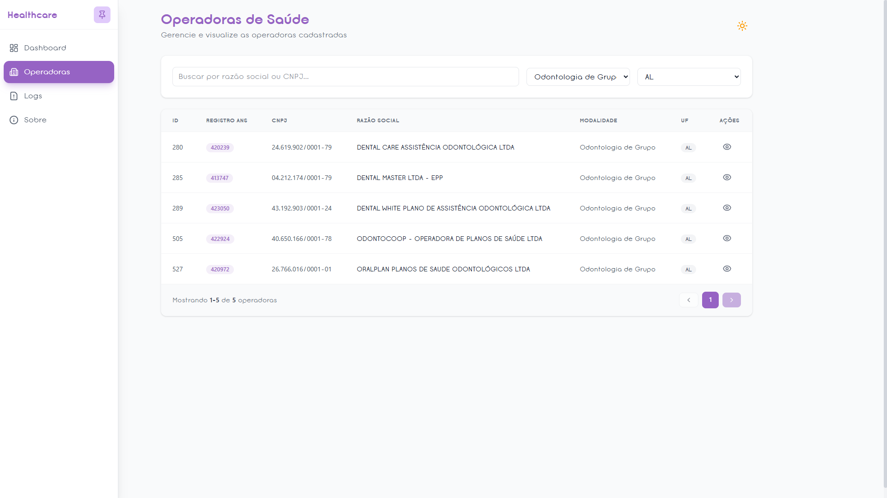
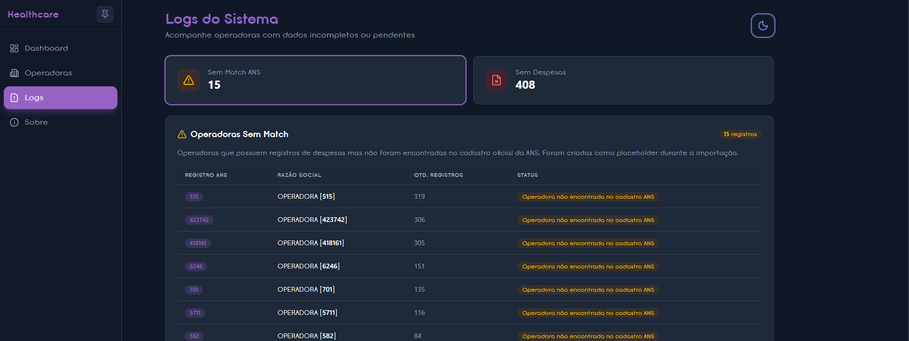

# Healthcare SaaS

Sistema de análise de despesas de operadoras de planos de saúde, com dados da ANS (Agência Nacional de Saúde Suplementar).


### Dashboard


### Tabela de Operadoras


### Logs de Qualidade


---

## 📋 Índice

- [Tecnologias](#-tecnologias)
- [Arquitetura](#-arquitetura)
- [Execução do Projeto](#-execução-do-projeto)
- [Decisões Técnicas](#-decisões-técnicas)

---

## 🛠 Tecnologias

### Backend

Documentação: <a hre="https://themarksan-3951969.postman.co/workspace/Marcos-Melo's-Workspace~9e84fb09-6e19-4a99-8e77-dfafb41159b9/collection/52005831-dd705396-6e18-4d0f-b912-484c458057da?action=share&creator=52005831">POSTMAN COLLECTION</a>

| Tecnologia | Versão | Uso |
|------------|--------|-----|
| Python | 3.12+ | Linguagem principal |
| FastAPI | 0.128+ | Framework web assíncrono |
| SQLAlchemy | 2.x | ORM com suporte async |
| MySQL | 8.0+ | Banco de dados relacional |
| Pydantic | 2.x | Validação de dados |
| Alembic | - | Migrações de banco |

### Frontend
| Tecnologia | Versão | Uso |
|------------|--------|-----|
| Vue.js | 3.x | Framework reativo (Composition API) |
| TypeScript | 5.x | Tipagem estática |
| Vite | 6.x | Build tool e dev server |
| TailwindCSS | 3.x | Estilização utility-first |
| Vue Router | 4.x | Roteamento SPA |
| Chart.js | 4.x | Gráficos interativos |
| Lucide Icons | - | Iconografia |

### Data Pipeline
| Tecnologia | Uso |
|------------|-----|
| Pandas | Processamento e transformação de dados |
| Requests | Download de arquivos da ANS |

---

## 🏗 Arquitetura

### Estrutura de Diretórios

```
healthcare_saas/
├── backend/
│   ├── src/
│   │   ├── api/           # Rotas e endpoints FastAPI
│   │   │   └── routes/    # Módulos de rotas
│   │   ├── core/          # Configurações e utilitários (cache, config)
│   │   ├── domain/        # Modelos, schemas e serviços de negócio
│   │   └── infra/         # Repositórios e conexão com banco
│   ├── scripts/           # Scripts de importação e setup
│   ├── tests/             # Testes unitários (pytest)
│   └── migrations/        # Migrações Alembic
├── frontend/
│   └── src/
│       ├── components/    # Componentes reutilizáveis
│       │   └── ui/        # Componentes base (Button, Card, etc.)
│       ├── composables/   # Lógica reativa compartilhada
│       ├── views/         # Páginas da aplicação
│       ├── router/        # Configuração de rotas
│       └── lib/           # Utilitários
├── data_pipeline/
│   ├── download.py        # Download de dados da ANS
│   ├── enrich.py          # Enriquecimento e validação
│   ├── analyze.py         # Geração de métricas
│   └── utils/             # Validadores e agregadores
└── run_pipeline.sh        # Script de execução completa
```

### Padrões Arquiteturais

- **Backend**: Clean Architecture com separação em camadas (API → Domain → Infra)
- **Frontend**: Composition API com Composables para lógica reutilizável
- **Pipeline**: ETL em chunks para processamento eficiente de memória

---

## 🚀 Execução do Projeto

### Pré-requisitos

- Python 3.12+
- Node.js 18+
- MySQL 8.0+

### 1. Pipeline de Dados (Primeiro Passo)

O script `run_pipeline.sh` automatiza todo o processo:

```bash
# Execução completa (instalação + pipeline)
./run_pipeline.sh

# Apenas instalar dependências
./run_pipeline.sh install

# Apenas executar pipeline (após instalação)
./run_pipeline.sh pipeline
```

**Ou manualmente:**

```bash
cd data_pipeline
source ../venv/bin/activate
python download.py    # Baixa dados da ANS (últimos 3 trimestres)
python enrich.py      # Enriquece e valida dados
python analyze.py     # Gera métricas (opcional)
```

### 2. Banco de Dados

```bash
# Criar banco MySQL
mysql -u root -p -e "CREATE DATABASE healthcare_saas CHARACTER SET utf8mb4 COLLATE utf8mb4_unicode_ci;"

# Configurar .env no backend
cd backend
cp .env.example .env

# Executar queries ddl
mysql -u root -p -h localhost healthcare_saas < scripts/ddl/create_tables.sql

# Edite DATABASE_URL com suas credenciais
```

### 3. Backend (API)

```bash
cd backend
source ../venv/bin/activate

# Importar dados processados
cd scripts/import
python import_data.py
python create_placeholder_operadoras.py

# Iniciar servidor
cd backend/src
uvicorn api.main:app --reload --host 0.0.0.0 --port 8000
```

**Endpoints disponíveis:**
- API: http://localhost:8000
- Documentação: http://localhost:8000/docs (Swagger)

### 4. Frontend (SPA)

```bash
cd frontend
npm install
npm run dev
```

**Acesse:** http://localhost:5173

### 5. Testes

```bash
# Backend (pytest)
cd backend && python -m pytest -v

# Frontend (vitest)
cd frontend && npm run test:unit
```

---

##  Análise Crítica - Tratamento de Inconsistências

Esta seção documenta todas as inconsistências encontradas nos dados e como cada uma foi tratada.

### Inconsistências na Consolidação

#### CNPJs Duplicados com Razões Sociais Diferentes

**Problema:** Mesmo CNPJ aparece com razões sociais diferentes em períodos distintos (mudança de nome, fusões, etc.)

**Tratamento:** Flag + resolução automática

```python
# detect_cnpj_conflicts() em validators.py
cnpj_razoes = df.groupby('CNPJ')['RazaoSocial'].unique()
cnpjs_conflito = cnpj_razoes[cnpj_razoes.apply(len) > 1]

# Resolução:
# 1. Se CNPJ existe no cadastro oficial → usa razão do cadastro
# 2. Senão → usa razão mais recente (maior ano/trimestre)
```

| Ação | Justificativa |
|------|---------------|
| Marcar com `CNPJConflict=True` | Permite auditoria posterior |
| Priorizar cadastro oficial | Fonte autoritativa da ANS |
| Fallback para razão mais recente | Assume dado mais atualizado |
| Salvar em `logs/data_equality_issues.csv` | Registro para análise manual |

---

#### Valores Zerados ou Negativos

**Problema:** Valores de despesas zerados (operação normal) ou negativos (estornos/correções)

**Tratamento:** Preservar todos os valores

| Valor | Ação | Justificativa |
|-------|------|---------------|
| `0.00` | Mantido | Pode indicar trimestre sem operação |
| Negativo | Mantido | Estornos contábeis são válidos |
| `NULL` | Convertido para `0.00` | Evita erros em agregações |

```python
# Durante agregação
chunk['ValorDespesas'] = pd.to_numeric(chunk['ValorDespesas'], errors='coerce')
# NaN resultante tratado como 0 na soma
```

**Justificativa:** Valores negativos são operações contábeis legítimas. Removê-los distorceria totais.

---

#### Trimestres com Formatos Inconsistentes

**Problema:** Formatos encontrados: `1T2024`, `01`, `1`, `1º`, datas completas

**Tratamento:** Normalização com rejeição de inválidos

```python
# normalize_trimestre() em validators.py
def normalize_trimestre(trimestre_str):
    # Aceita: "1T2024" → 1, "01" → 1, "1" → 1
    # Rejeita: valores < 1 ou > 4, formatos não reconhecidos
    
    if trimestre < 1 or trimestre > 4:
        logging.warning(f"Trimestre fora do range: {trimestre_str}")
        return None  # Registro será descartado
```

| Formato | Resultado | Ação |
|---------|-----------|------|
| `1T2024` | `1` | Extrai número |
| `01`, `1` | `1` | Converte direto |
| `5`, `0`, `-1` | `None` | Rejeita + log |
| `Q1`, `1º` | `None` | Rejeita + log |

**Justificativa:** Trimestres inválidos indicam erro na fonte. Melhor rejeitar do que importar dado corrompido.

---

### Inconsistências no Match com Cadastro

#### Registros sem Match no Cadastro (REG_ANS órfãos)

**Problema:** Despesas com REG_ANS que não existe no cadastro de operadoras ativas

**Tratamento:** Preservar com flag + placeholder + linkagem automática

```python
# 1. Pipeline: identify_unmatched_reg_ans() em validators.py
df['CadastroIncompleto'] = mask_sem_cnpj
df.loc[mask_vazio, 'RazaoSocial'] = f"OPERADORA [{reg_ans}]"

# 2. Banco: create_placeholder_operadoras.py
# Cria operadoras na tabela 'operadoras' e linka despesas/métricas
INSERT IGNORE INTO operadoras (registro_ans, razao_social, uf, modalidade, cnpj)
UPDATE despesas_trimestrais SET operadora_id = o.id WHERE operadora_id IS NULL
UPDATE metricas_operadoras SET operadora_id = o.id WHERE operadora_id IS NULL
```

| Campo | Valor Aplicado |
|-------|----------------|
| `RazaoSocial` | `"OPERADORA [123456]"` (placeholder com REG_ANS) |
| `CNPJ` | Vazio |
| `CadastroIncompleto` | `True` |
| `Modalidade`, `UF` | Vazios (herdados das despesas se disponíveis) |

**Script `create_placeholder_operadoras.py`:**
1. Busca operadoras órfãs (despesas sem `operadora_id`)
2. Insere operadoras placeholder na tabela `operadoras`
3. Atualiza `despesas_trimestrais.operadora_id` via JOIN
4. Atualiza `metricas_operadoras.operadora_id` via JOIN
5. Compatível com TiDB Cloud (SSL)

**Log gerado:** `logs/unmatched_reg_ans.csv` com estatísticas por REG_ANS

**Justificativa:** 
- Operadoras podem ter sido desativadas mas ainda ter despesas históricas
- Preservar dados permite análise de tendências
- Flag permite filtrar em queries quando necessário
- Linkagem garante que todas as operadoras apareçam nas views do sistema

---

#### CNPJs Múltiplos no Cadastro (duplicatas)

**Problema:** Mesmo CNPJ aparece múltiplas vezes no cadastro com dados diferentes

**Tratamento:** Usar primeiro registro encontrado

```python
# merge com how='left' usa primeiro match por padrão
enriched = chunk.merge(operadoras_lookup, ..., how='left')
```

**Justificativa:** 
- Cadastro oficial da ANS não deveria ter duplicatas
- Se houver, assumimos que são versões (usamos a mais recente no arquivo)
- Volume baixo de duplicatas (~0.1%) não justifica lógica complexa

---

### Inconsistências na Importação para Banco

#### Valores NULL em Campos Obrigatórios

**Tratamento por campo:**

| Campo | Obrigatório | Ação se NULL |
|-------|-------------|--------------|
| `registro_ans` | Sim | Rejeitar registro |
| `razao_social` | Sim | Usar placeholder `"OPERADORA [REG_ANS]"` |
| `cnpj` | Não | Aceitar vazio (cadastro incompleto) |
| `valor_despesas` | Sim | Converter para `0.00` |
| `trimestre`, `ano` | Sim | Rejeitar registro |
| `uf`, `modalidade` | Não | Aceitar vazio |

**Implementação:** Stored Procedure `sp_import_despesa` valida antes do INSERT

---

#### Strings em Campos Numéricos

**Problema:** `ValorDespesas` com valores como `"N/A"`, `"-"`, `"#REF!"`

**Tratamento:** Conversão com coerção

```python
chunk['ValorDespesas'] = pd.to_numeric(chunk['ValorDespesas'], errors='coerce')
# Strings não numéricas → NaN → tratado como 0
```

| Valor Original | Resultado | Ação |
|----------------|-----------|------|
| `"1234.56"` | `1234.56` | Conversão OK |
| `"1.234,56"` (BR) | `NaN` → `0.00` | Formato não suportado |
| `"N/A"`, `"-"` | `NaN` → `0.00` | Coerção |
| `"#REF!"` | `NaN` → `0.00` | Erro de planilha |

**Justificativa:** Assumir `0.00` é conservador e não distorce agregações de soma.

---

#### CNPJs Inválidos (Dígito Verificador)

**Problema:** CNPJs com formato correto (14 dígitos) mas dígitos verificadores incorretos

**Tratamento:** Validação algorítmica + flag

```python
# validate_cnpj() em validators.py
# Implementa validação completa com dígitos verificadores

df['CNPJInvalido'] = ~df['CNPJ'].apply(validate_cnpj)
```

| Validação | Resultado |
|-----------|-----------|
| Comprimento ≠ 14 | Inválido |
| Todos dígitos iguais | Inválido |
| DV1 incorreto | Inválido |
| DV2 incorreto | Inválido |

**Log gerado:** `logs/invalid_cnpjs.csv`

**Justificativa:** 
- CNPJs inválidos podem ser erros de digitação na fonte
- Preservamos para não perder dados de despesas
- Flag permite filtrar em análises que exigem CNPJ válido

---

### Resumo das Flags de Qualidade

| Flag | Significado | Arquivo de Log |
|------|-------------|----------------|
| `CNPJConflict` | CNPJ com múltiplas razões sociais | `data_equality_issues.csv` |
| `RazaoSocialAusente` | Razão social ausente (placeholder aplicado) | - |
| `CadastroIncompleto` | REG_ANS não encontrado no cadastro | `unmatched_reg_ans.csv` |
| `CNPJInvalido` | CNPJ falha validação de dígitos | `invalid_cnpjs.csv` |

Todas as flags são preservadas no banco de dados, permitindo:
- Filtros em queries (`WHERE cnpj_invalido = FALSE`)
- Dashboards de qualidade de dados
- Auditoria e rastreabilidade

---

## 📐 Decisões Técnicas

### 1.2. Pipeline - Processamento em Memória vs Incremental

**Decisão:** Processamento incremental em chunks (50.000 registros)

**Justificativa:**
- Volume de dados: ~500MB por trimestre, ~1.5GB total para 3 trimestres
- Memória limitada em ambientes de desenvolvimento
- O processamento em chunks permite:
  - Execução em máquinas com 4GB RAM
  - Feedback de progresso durante execução
  - Recuperação parcial em caso de falha

**Implementação:** `enrich.py` usa `pd.read_csv(..., chunksize=50000)`

---

### 2.1. Pipeline - Tratamento de CNPJs Inválidos

**Decisão:** Manter registros com flag de validação

**Estratégia:**
1. CNPJs inválidos são marcados com `cnpj_invalido = True`
2. Registros são mantidos no banco para análise
3. Log de CNPJs inválidos salvo em `logs/invalid_cnpjs.csv`

**Prós:**
- Preserva todos os dados para auditoria
- Permite análise de qualidade dos dados fonte
- Não descarta informações potencialmente úteis

**Contras:**
- Aumenta volume do banco de dados
- Requer filtro em queries quando necessário

---

### 2.2. Pipeline - Estratégia de Join

**Decisão:** Left Join com lookup em memória

**Implementação:**
```python
enriched = chunk.merge(
    operadoras_lookup,
    left_on='REG_ANS',
    right_on='REGISTRO_OPERADORA',
    how='left'
)
```

**Justificativa:**
- Cadastro de operadoras (~2.000 registros) cabe em memória
- Left join preserva despesas mesmo sem match (marcadas como `CadastroIncompleto`)
- Operadoras sem match são logadas em `logs/unmatched_reg_ans.csv`

---

### 2.3. Pipeline - Estratégia de Ordenação

**Decisão:** Ordenação durante agregação, não em arquivo final

**Justificativa:**
- Agregação com `groupby().sum()` já ordena internamente
- Ordenação final delegada ao banco de dados via índices
- Evita ordenação de milhões de registros em memória

---

### 3.2.1. Banco de Dados - Normalização de Tabelas

**Decisão:** Híbrido (parcialmente normalizado)

**Estrutura:**
```
operadoras (tabela de dimensão)
├── id, registro_ans, cnpj, razao_social, modalidade, uf

despesas_trimestrais (tabela de fatos - desnormalizada)
├── registro_ans, cnpj, razao_social, uf, modalidade  # Redundância intencional
├── ano, trimestre, valor_despesas
├── operadora_id (FK opcional)
```

**Justificativa:**
- **Volume:** ~500K registros de despesas
- **Frequência de atualização:** Trimestral (baixa)
- **Queries analíticas:** JOINs custosos para dashboards

A desnormalização na tabela de despesas:
- Elimina JOINs em queries de agregação (95% dos acessos)
- FK opcional permite integridade sem bloquear importação
- Trade-off aceitável: +20% storage vs -80% tempo de query

---

### 3.2.2. Banco de Dados - Tipagem de Valores

**Valores Monetários:** `DECIMAL(15, 2)`

**Justificativa:**
- Precisão exata para operações financeiras (não usar FLOAT!)
- 15 dígitos suportam valores até R$ 9.999.999.999.999,99
- 2 casas decimais padrão brasileiro

**Datas/Períodos:** `SMALLINT` para ano e trimestre

**Justificativa:**
- Trimestre (1-4) e Ano (2020-2030) são valores discretos
- Queries de filtro por período mais eficientes que DATE
- Menor footprint de storage

---

### 3.4. Query - Operadoras Acima da Média

**Decisão:** CTE (Common Table Expression) com agregação em duas etapas

**Query:**
```sql
WITH media_por_trimestre AS (
    SELECT ano, trimestre, AVG(valor_despesas) AS media_geral
    FROM despesas_trimestrais
    WHERE valor_despesas > 0
    GROUP BY ano, trimestre
),
operadoras_acima AS (
    SELECT 
        d.registro_ans,
        SUM(CASE WHEN d.valor_despesas > m.media_geral THEN 1 ELSE 0 END) AS trimestres_acima
    FROM despesas_trimestrais d
    INNER JOIN media_por_trimestre m ON d.ano = m.ano AND d.trimestre = m.trimestre
    GROUP BY d.registro_ans
    HAVING trimestres_acima >= 2
)
SELECT * FROM operadoras_acima;
```

**Justificativa:**
- CTEs melhoram legibilidade e manutenibilidade
- Cálculo de média por trimestre evita distorções
- `HAVING >= 2` é configurável
- Performance aceitável com índices em (ano, trimestre)

---

### 4.2.1. Backend - Escolha de Framework

**Decisão:** FastAPI

**Justificativa:**
| Critério | Flask | FastAPI |
|----------|-------|---------|
| Performance | Síncrono | Assíncrono (async/await) |
| Documentação | Manual | Automática (OpenAPI) |
| Validação | Manual | Pydantic integrado |
| Tipagem | Opcional | Nativa |

FastAPI foi escolhido por:
- Suporte nativo a async (importante para I/O de banco)
- Documentação Swagger automática
- Validação de schemas com Pydantic
- Ecossistema moderno e bem mantido

---

### 4.2.2. Backend - Estratégia de Paginação

**Decisão:** Paginação Híbrida (Keyset + Offset)

**Implementação:**
```python
# Keyset (cursor): "razao_social|registro_ans" - para navegação sequencial
if cursor:
    parts = cursor.split('|')
    query = query.where(
        (Operadora.razao_social > cursor_razao) |
        ((Operadora.razao_social == cursor_razao) & (Operadora.registro_ans > cursor_reg))
    )

# Offset: para saltos diretos a páginas distantes
if offset is not None:
    query = query.offset(offset).limit(limit + 1)
```

**Comparação:**
| Aspecto | Offset | Cursor/Keyset | Híbrido |
|---------|--------|---------------|---------|
| Performance páginas altas | O(n) - degrada | O(1) - constante | O(1) com cache |
| Salto direto a página | ✅ Nativo | ❌ Requer N requests | ✅ Usa offset |
| Consistência com inserções | Pode pular/duplicar | Estável | Estável (cursor) |
| Implementação | Simples | Moderada | Moderada |

**Estratégia no Frontend:**
```typescript
// useOperadoras.ts
if (cachedCursor) {
  // Cache hit: usa keyset pagination (mais eficiente)
  fetchOperadoras({ cursor: cachedCursor });
} else {
  // Cache miss: usa offset para salto direto (evita N requests)
  fetchWithOffset(targetPage);
}
```

**Justificativa:**
- **Keyset** para navegação sequencial (próxima/anterior): O(1) constante
- **Offset** como fallback para saltos diretos: evita N requisições sequenciais
- Cache de cursors no frontend otimiza navegação frequente
- Antes: acessar página 100 = 100 requisições (~30s)
- Depois: acessar página 100 = 1 requisição com offset (~200ms)

---

### 4.2.3. Backend - Cache vs Queries Diretas

**Decisão:** Cache em memória com TTL de 5 minutos

**Implementação:** `core/cache.py` - SimpleCache

```python
cache = SimpleCache(default_ttl=300)  # 5 minutos

# Uso em rotas
@router.get("/estatisticas")
async def get_estatisticas():
    return await cache.get_or_set(
        f"estatisticas:{uf or 'all'}",
        lambda: service.get_estatisticas_agregadas(uf)
    )
```

**Justificativa:**
- Dados atualizados trimestralmente (baixa frequência)
- Queries de agregação custosas (~200ms sem cache)
- TTL de 5 minutos balanceia freshness vs performance
- Cache invalidado automaticamente por expiração

---

### 4.2.4. Estrutura de Resposta da API

**Decisão:** Dados + Metadados

**Formato:**
```json
{
  "data": [...],
  "total": 1847,
  "page": 1,
  "limit": 10,
  "has_next": true,
  "has_prev": false,
  "next_cursor": "BRADESCO SAUDE|326305"
}
```

**Justificativa:**
- `total` permite exibir "X de Y" no frontend
- `has_next/has_prev` simplifica lógica de navegação
- `next_cursor` para keyset pagination
- Padrão consistente em todas as rotas de listagem

---

### 4.3.1. Frontend - Estratégia de Busca/Filtro

**Decisão:** Busca no servidor com debounce

**Implementação:**
```typescript
// SearchBar.vue - debounce de 400ms
debounceTimer = setTimeout(() => {
    emit('search', search.value);
}, 400);
```

**Justificativa:**
- ~2.000 operadoras: busca no cliente seria viável
- Porém, servidor permite:
  - Busca por CNPJ com normalização (`12.345.678/0001-90` → `12345678000190`)
  - Filtros compostos (UF + Modalidade + texto)
  - Paginação consistente com resultados filtrados
- Debounce evita requisições excessivas durante digitação

---

### 4.3.2. Frontend - Gerenciamento de Estado

**Decisão:** Composables (Vue 3 Composition API)

**Estrutura:**
```
composables/
├── useOperadoras.ts    # Estado de listagem e paginação
├── useAnalytics.ts     # Estatísticas e gráficos
└── useTheme.ts         # Dark mode
```

**Justificativa:**
- Aplicação de complexidade média (não necessita Pinia/Vuex)
- Composables permitem:
  - Lógica reativa encapsulada e reutilizável
  - Tipagem TypeScript completa
  - Teste unitário isolado
- Cada composable gerencia seu domínio específico

---

### 4.3.3. Performance da Tabela

**Decisão:** Paginação server-side com renderização simples

**Implementação:**
- Limite de 10-50 itens por página
- Sem virtualização (não necessário para este volume)
- Skeleton loading durante fetch

**Justificativa:**
- Máximo ~50 linhas visíveis por vez
- Virtualização (vue-virtual-scroller) seria over-engineering
- Keyset pagination garante performance consistente em qualquer página

---

### 4.3.4. Tratamento de Erros e Loading

**Decisão:** Estados específicos com feedback visual

**Implementação:**
```
components/
├── ErrorState.vue       # Erros de API (network, 404, 500)
├── LoadingSpinner.vue   # Estado de carregamento
views/
├── NotFoundView.vue     # Página 404 global
├── ConnectionErrorView.vue  # Erro de conexão
└── ErrorView.vue        # Erro genérico parametrizável
```

**Tipos de erro tratados:**
| Tipo | Ícone | Mensagem |
|------|-------|----------|
| `network` | WifiOff | "Conexão não estabelecida" |
| `server` | ServerCrash | "Erro no servidor" |
| `not-found` | FileQuestion | "Não encontrado" |
| `generic` | AlertTriangle | "Algo deu errado" |

**Análise crítica:**
- **Mensagens específicas** para erros de rede (mais comum em ambiente real)
- **Botão "Tentar Novamente"** com feedback visual (spinner)
- **Detalhes técnicos** opcionais para debug (ocultáveis)
- **Não expõe** stack traces ou informações sensíveis ao usuário

**Estados vazios:**
- Tabela sem dados: mensagem "Nenhuma operadora encontrada"
- Dashboard sem estatísticas: cards com valores zerados (não erro)

---

## 📄 Licença

MIT License - veja [LICENSE](LICENSE) para detalhes.
